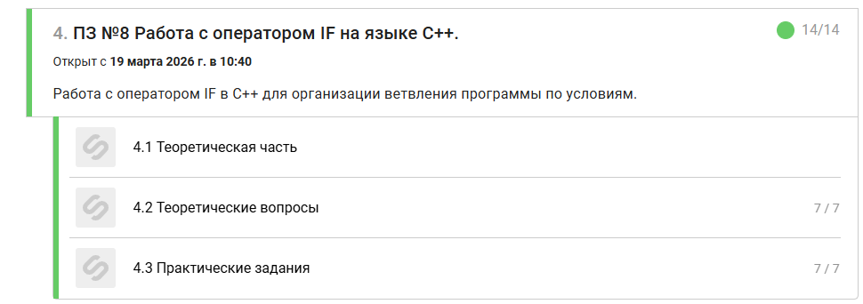

# Prakticheskoe zadanie №8

-----------------------------------------------------------------------------------------------------

## Zadanie 1
#include <iostream>

using namespace std;

int main() 
{
    // Настройка корректного отображения русского языка в консоли
    setlocale(LC_ALL, "Russian");

    int number; // Объявляем переменную для хранения числа
    cin >> number; // Считываем число с клавиатуры

    // Ваш код:
    if (number > 0) // Если число больше нуля 
    {
        cout << "Положительное";
    }                     
}

-----------------------------------------------------------------------------------------------------

## Zadanie 2
#include <iostream>

using namespace std;

int main() 
{
    // Настройка корректного отображения русского языка в консоли
    setlocale(LC_ALL, "Russian");

    int number; // Объявляем переменную для хранения числа
    cin >> number; // Считываем число с клавиатуры

    // Ваш код:
    if (number == 10) // Если число равно 10 
    {
        cout << "Число равно 10";
    }
    else // Если число не равно 10
    {
        cout << "Число не равно 10";
    }
                        
}

-----------------------------------------------------------------------------------------------------

## Zadanie 3
#include <iostream>

using namespace std;

int main() 
{
    // Настройка корректного отображения русского языка в консоли
    setlocale(LC_ALL, "Russian");

    int number; // Объявляем переменную для хранения числа
    cin >> number; // Считываем число с клавиатуры

    // Ваш код:
    if (number >= 0) // Если число больше нуля 
    {
        cout << "Число не отрицательное";
    }
    else if (number < 0) // Если число меньше нуля
    {
        cout << "Число отрицательное";
    }                  
}

-----------------------------------------------------------------------------------------------------

## Zadanie 4
#include <iostream>

using namespace std;

int main() 
{
    // Настройка корректного отображения русского языка в консоли
    setlocale(LC_ALL, "Russian");

    int a, b; // типа объявляем переменные
    cin >> a >> b; // вводим числа

    if (a > b) // Если число a больше b
    {
        cout << "Большее число: " << a;
    }
    else if (a < b) // Если число a меньше b
    {
        cout << "Большее число: " << b;
    }
    else // Если число a равно b
    {
        cout << "Числа равны";
    }
                        
}

-----------------------------------------------------------------------------------------------------

## Zadanie 5
#include <iostream>

using namespace std;

int main() 
{
    // Настройка корректного отображения русского языка в консоли
    setlocale(LC_ALL, "Russian");

    int a; // типа объявляем переменные
    cin >> a; // вводим число

    if (a >= 1 && a <= 10) // Если число входит в диапазон
    {
        cout << "Число принадлежит диапазону";
    }

    else // Если число не входит в диапазон
    {
        cout << "Число не принадлежит диапазону";
    }
                        
}

-----------------------------------------------------------------------------------------------------

## Zadanie 6
#include <iostream>

using namespace std;

int main() 
{
    // Настройка корректного отображения русского языка в консоли
    setlocale(LC_ALL, "Russian");

    int a; // типа объявляем переменные
    cin >> a; // вводим число

    if ((a >= 1 && a <= 5) || (a >= 10 && a <= 15)) // Если число входит в  какой-то из диапазонов
    {
        cout << "Число принадлежит одному из диапазонов";
    }

    else // Если число не входит ни в какой диапазон
    {
        cout << "Число не принадлежит указанным диапазонам";
    }
                        
}

-----------------------------------------------------------------------------------------------------

## Zadanie 7
#include <iostream>

using namespace std;

int main() 
{
    // Настройка корректного отображения русского языка в консоли
    setlocale(LC_ALL, "Russian");

    int a; // типа объявляем переменные
    cin >> a; // вводим число

    if ((a < 100) && (a % 2 == 0) && (a > 0)) // Если число меньше 100 и четное и положительное
    {
        cout << "Подходит";
    }
    
    else
    {
        cout << "Не подходит";
    }
}
